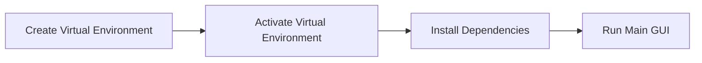

# 🔍 Digital Forensics Toolkit **v1.0**  
*A Python-Powered Forensic Swiss Army Knife*  

 *Trusted Analysis* | ! Cross-Platform *Linux/Windows Support*

---

## 🚀 Features  
| Operation | Status | Icon |  
|-----------|--------|------|  
| Memory Dump | ✅ Stable | 🧠 |  
| Network Traffic Analysis | ✅ Stable | 🌐 |  
| File Recovery | ✅ Stable | 📂 |  
| Metadata Extraction | ✅ Stable | 🔍 |  
| Partition Disk Imaging | ⚠️ Unstable | 💾 |  

---

## 🌐 Cross-Platform Support  
  
  

---

## ⚙️ Setup Guide  

### 📥 Prerequisites  
- Python 3.8+  
- 100MB Disk Space  
- Administrator/Root Privileges  

---

### 🪟 Windows Installation  



1. **Create Virtual Environment**  
   ```bash  
   python -m venv forensic_env  
   ```  
   *(Replace `forensic_env` with your preferred name)*  

2. **Activate Environment**  
   ```bash  
   forensic_env\Scripts\activate  
   ```  

3. **Install Dependencies**  
   ```bash  
   python -m pip install -r requirements.txt  
   ```  

4. **Launch Application**  
   ```bash  
   python "Main GUI.py"  
   ```  

---

### 🐧 Linux Installation  


```bash  
# Full installation command sequence  
python3 -m venv forensic_env && \  
source forensic_env/bin/activate && \  
python3 -m pip install -r requirements.txt && \  
sudo -E python3 "Main GUI.py"  
```

---

## 🔗 Integrated Tools  
| Tool | Purpose | Official Link |  
|------|---------|---------------|  
| 🔍 MetaLookup | Metadata Extraction | [GitHub](https://github.com/JMousqueton/MetaLookup) |  
|  WinPmem | Windows Memory Dump | [GitHub](https://github.com/Velocidex/WinPmem) |  
|  Linpmem | Linux Memory Dump | [GitHub](https://github.com/Velocidex/c-aff4/releases) |  
| 💾 OSFMount | Disk Imaging | Bundled |  

**note: OSFMount is used externaly out of the tool kit**

---

## ⚠️ Disk Imaging Guide  
**Common Issue**: System processes locking partitions  

```diff  
- Critical: Never image active system partitions (e.g., C:\)  
+ Pro Tip: Use secondary drives or non-system partitions  
```

### 🛠️ Troubleshooting Steps for disk imaging (Windows)
```powershell  
# Admin Command Prompt  
1. diskpart  
2. list volume  
3. select volume <X>  
4. remove letter=<PartitionLetter>  
5. offline volume  
6. assign letter=<NewLetter>  
7. online volume  
```

---

## 📜 Project Notes  
> "This toolkit demonstrates core forensic capabilities through Python integration. While functional, treat it as educational material rather than enterprise-grade software."  
 

---

## 🎨 UI Preview  
```  
+------------------------------+  
|  Digital Forensics Toolkit   |  
+------------------------------+  
| [🧠] Memory Dump             |  
| [🌐] Network Analysis        |  
| [📂] File Recovery           |  
| [🔍] Metadata Extraction     |  
| [💾] Disk Imaging            |  
+------------------------------+  
```

---

**Happy Forensic Analysis!** 🔎✨  
